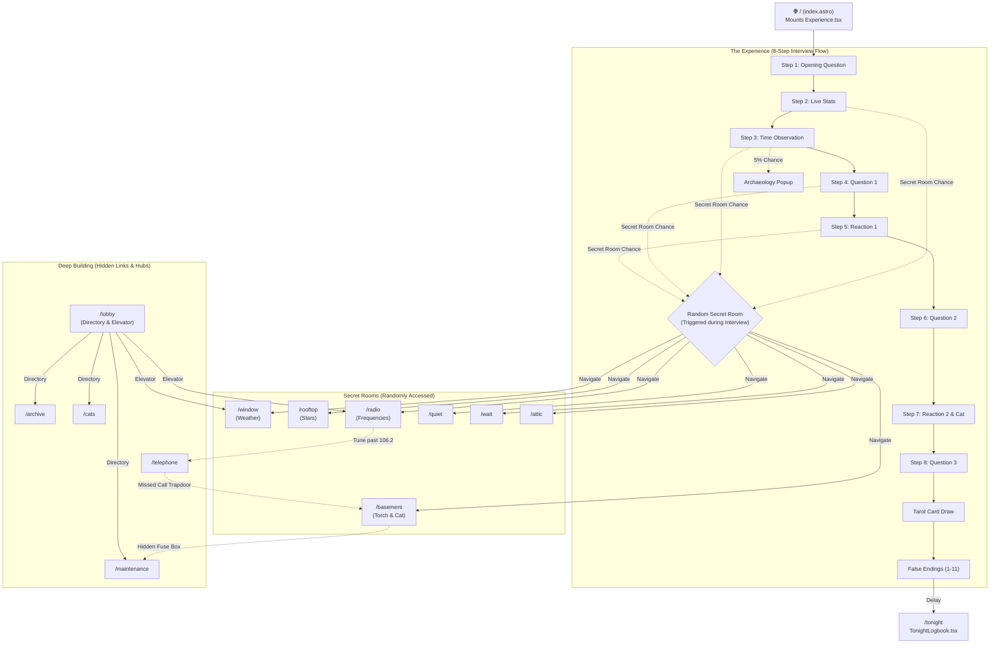

# okayimbored - Detailed Content & File Flowchart

This document maps out the current architecture, files, and user journeys of the `okayimbored` project after recent simplifications.

## 📁 Directory Structure & File Roles

### `src/pages/` (Routes)
- **`index.astro`**: The main entry point. Mounts the `Experience.tsx` component.
- **`tonight.astro`**: The logbook page shown after the main flow ends.
- **Secret Rooms**: `window.astro`, `basement.astro`, `rooftop.astro`, `radio.astro`, `telephone.astro`, `quiet.astro`, `wait.astro`, `attic.astro`.
- **Deep Building**: `lobby.astro`, `archive.astro`, `maintenance.astro`, `notices.astro`, `cats.astro`, `lost-and-found.astro`.
- **SEO/Discovery**: `im-bored.astro`, `about.astro`, `faq.astro`, `games-to-play-when-bored.astro`, `things-to-draw-when-bored.astro`, etc.

### `src/components/` (Interactive Logic)
- **`Experience.tsx`**: The core 8-step interview flow. Handles state, questions, rare events, and transitions.
- **`TheLobby.tsx`**: The building directory and elevator hub.
- **`TheBasement.tsx`**: Interactive torch mechanic, cats, hidden fuse box.
- **`RadioRoom.tsx`**: Radio frequency tuning and cryptic audio.
- **`TelephoneRoom.tsx`**: Ringing phone with answering mechanic.
- **`TonightLogbook.tsx`**: Displays session stats and echoes after the user finishes the main flow.
- **`TarotCards.tsx`**: The card drawing logic used in the main experience.
- **`ArchaeologyEvent.tsx`**: The rare popup event in the main flow.
- **`WindowExperience.tsx` / `RooftopExperience.tsx` / `Archive.tsx` / etc**: Specialized logic for individual secret rooms.

### `src/lib/` (Core Utilities)
- **`echoes.ts`**: Manages `sessionStorage` for invisible narrative journeys (tracking where the user has been and choices they made).
- **`store.ts`**: Zustand state management for local metrics like restlessness, curiosity, and pity timers for secret rooms.
- **`supabase.ts`**: Database connection for stats and logging interactions.
- **`shift.ts`**: Time-of-day logic (Day, Evening, Night, After Hours).

---

## 🗺️ User Journey Flowchart

## 🔄 Core Mechanics Explained

1. **The Interview (`Experience.tsx`)**: The user goes through conversational prompts. Their `restlessness` and `curiosity` scores are tracked via Zustand. If they click too quickly, restlessness increases. 
2. **Secret Rooms Chance**: Between steps 2-9, there is a small chance (augmented by a pity timer and curiosity score) to interrupt the interview and redirect the user to a secret room (e.g., `/window`, `/basement`).
3. **Echoes (`sessionStorage`)**: Actions (like answering the phone, choosing honesty, or visiting the basement) are logged as "echoes" which subtly alter text and probabilities in other rooms across the site.
4. **False Endings**: At the end of the interview, the user is presented with one of 11 "false endings". Which ending they get is heavily determined by their echoes and scores. They are eventually redirected to `/tonight` to read their customized logbook.
