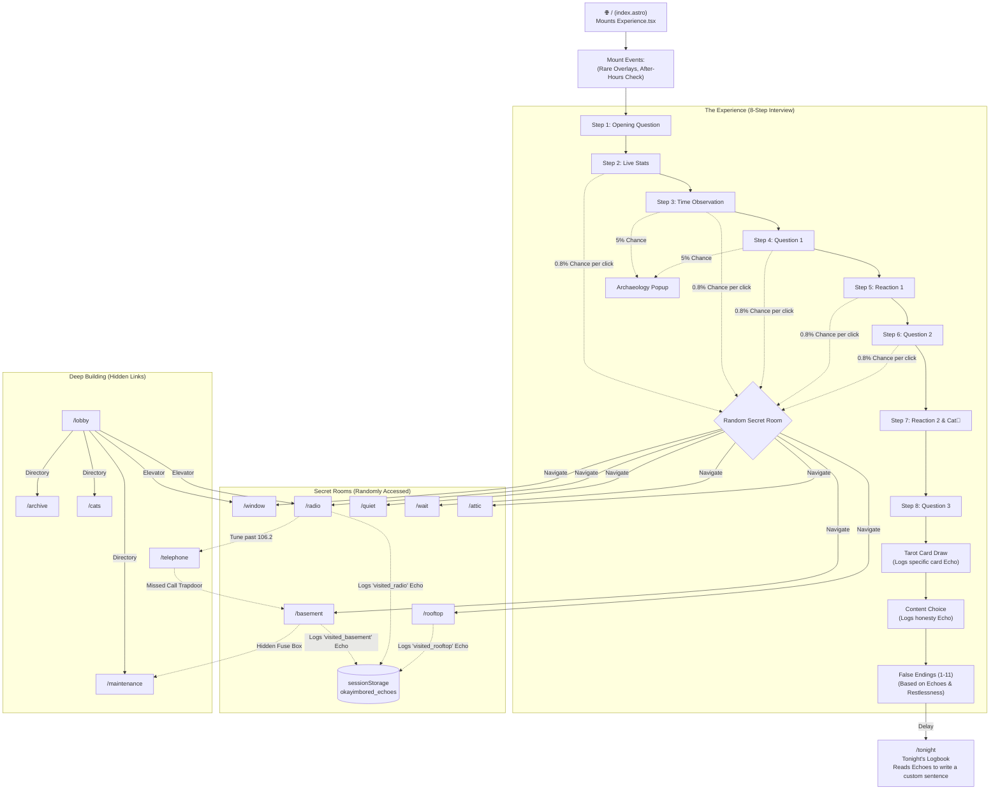

# okayimbored — V28 Architecture & Detailed Flowchart

This document maps out the specific file architecture, logic paths, and interactive journeys for the `okayimbored` project as it exists in **Version 28 (V28)**.

## 📁 V28 Directory Structure & File Roles

### `src/pages/` (Routes)
- **`index.astro`**: The main entry point. Mounts the `Experience.tsx` component (the 8-step interview).
- **`tonight.astro`**: The logbook page shown after the main flow ends, displaying personalized echoes.
- **`after-hours.astro`**: The hidden late-night page with time-gated access logic.
- **Secret Rooms**: `window.astro`, `basement.astro`, `rooftop.astro`, `radio.astro`, `telephone.astro`, `quiet.astro`, `wait.astro`, `attic.astro`, `polaroid.astro`.
- **Deep Building / Hubs**: `lobby.astro`, `archive.astro`, `maintenance.astro`, `notices.astro`, `cats.astro`, `cats-showcase.astro`, `lost-and-found.astro`.
- **SEO/Discovery**: `im-bored.astro`, `about.astro`, `faq.astro`, `games-to-play-when-bored.astro`, `things-to-draw-when-bored.astro`, `what-to-do-when-bored.astro`, `why-am-i-bored.astro`, `random-websites.astro`, `bored-button.astro`, `bored-at-night.astro`.

### `src/components/` (Interactive Logic)
- **`Experience.tsx`**: The core 8-step interview flow. Handles state, conversational questions, false endings, secret room triggers, and the idle timeout event.
- **`TheLobby.tsx`**: A purely deep-building hub (Building Directory and Elevator) with ambient events (phone ringing, elevator opening, cats walking).
- **`TheBasement.tsx`**: Interactive torch mechanic, cats with glowing eyes, and hidden links to maintenance.
- **`RadioRoom.tsx`**: Radio frequency tuning component with cryptic broadcasts.
- **`TelephoneRoom.tsx`**: Ringing phone with an answering mechanic and 20s timeout.
- **`NoticeBoard.tsx`**: A bulletin board of cryptic notes.
- **`MaintenanceRoom.tsx`**: Flickering lights and CRT messages.
- **`CatDepartment.tsx`**: Office for the cats, with rare sleeping employee events.
- **`LostAndFound.tsx`**: Dynamic item claiming/arriving system.
- **`Archive.tsx`**: 7 sections of retired project history.
- **`TonightLogbook.tsx`**: Displays session stats and echoes after the user finishes the main flow.
- **`TarotCards.tsx`**: The card drawing logic used in Step 6 of the main experience.
- **`ArchaeologyEvent.tsx`**: The rare popup event that randomly interrupts steps 2-6.
- **`PixelCat` (in `LivingCats/`)**: Handles cat rendering and animations across different rooms.

### `src/lib/` (Core Utilities)
- **`echoes.ts`**: (Introduced in V28) Manages `sessionStorage` for "Invisible Narrative Journeys", tracking where the user has been and the choices they made to alter probabilities elsewhere.
- **`store.ts`**: Zustand state management for local session metrics (restlessness, curiosity, pity timers).
- **`supabase.ts`**: Database connection for recording stats and logging interactions.
- **`shift.ts`**: Time-of-day logic (Day, Evening, Night, After Hours) which modifies global behavior.
- **`curiosity.ts` & `archaeology.ts`**: Generators for rare artifacts and popup messages.

---

## 🗺️ V28 User Journey Flowchart

## 🔄 V28 Mechanics Explained

1. **The Interview (`Experience.tsx`)**: The user goes through conversational prompts. Their `restlessness` and `curiosity` scores are tracked via Zustand. If they click too quickly, restlessness increases. 
2. **Secret Rooms Chance**: Between steps 2-7, there is a small 0.8% chance (augmented by a pity timer and curiosity score) to interrupt the interview and redirect the user to a secret room. If this rolls successfully, the archaeology popup will not appear.
3. **Echoes (`sessionStorage` - V28 Focus)**: Actions (like answering the phone, choosing honesty, drawing a specific Tarot card, or visiting a secret room) are logged as "echoes". These echoes subtly alter text and probabilities in other rooms (e.g. visiting the Basement adds a memory to the Archive, or answering the Telephone alters a radio broadcast).
4. **False Endings**: At the end of the interview, the user is presented with one of 11 "false endings". In V28, the ending they get is heavily determined by their echoes (e.g. `chose_honesty` forces Type 10, exploring rooms forces Type 7) and their restlessness scores. They are eventually redirected to `/tonight` to read their customized logbook.
