```mermaid
flowchart TD
    ENTRY["🌐 / (index)\nExperience loads\nExperience.tsx mounts"] --> MOUNT_CHECKS["On mount: 3 independent checks fire simultaneously"]

    MOUNT_CHECKS -->|"Check A: is3AM (hour=3, min=7)\nOR rand > 0.92\n→ ~8% + exact time match\n→ 5000ms delay"| RARE_EVENT["✨ Rare Event Overlay\n(1 of 5 messages, random pick)\nSets hasSeenRareEvent=true"]

    MOUNT_CHECKS -->|"Check B: hour 0–5 (isLateNight)\nAND Math.random() < 0.05\n→ 5% chance if midnight–5:59 AM\n→ 3000ms delay"| AFTER_HOURS["/after-hours\n🌙 After Hours Page\nmidnight–5:59 AM: 'continue.'\n6 AM+: 'go back.'"]

    MOUNT_CHECKS -->|"Check C: POST /api/session\nIF data.message present\nAND !isRareEventActive\n→ 8000ms delay"| SESSION_MSG["✨ Country/Server Rare Event\n(data.message as title)\nSets hasSeenRareEvent=true"]

    MOUNT_CHECKS -->|"None triggered\n(or returning with\nokayimbored_returning_from_secret)"| S1

    RARE_EVENT -->|"'Return' button"| S1["Step 1\n'Are you bored?'\nYes / No\n(Both choices call nextStep())"]
    SESSION_MSG -->|"'Return' button"| S1
    AFTER_HOURS -->|"Button click:\nsessionStorage flag set\nnavigate('/')"| S1

    S1 -->|"Either Yes or No\n→ handleInteraction('are_you_bored', value)\n→ nextStep()\n(step=1: secret/archaeology guards\nneed step > 1, so skipped)"| S2["Step 2\nBored % stats from /api/stats (live):\n'{boredPercentage}% said they were bored.'\n'{100 - boredPercentage}% claimed just checking.'\n'We don't believe them.'"]

    S2 -->|"'Continue' button\n→ nextStep()\nstep=2 (> 1 AND < 8)"| SECRET_CHECK2{"Secret Room check\nMath.random() < 0.008"}
    SECRET_CHECK2 -->|"0.8%\n→ random 1 of 7 rooms (equal weight)\n→ navigate(randomRoom)"| SECRET_ROOMS["🚪 Secret Rooms\n(7 rooms, equal weight)"]
    SECRET_CHECK2 -->|"99.2%"| ARCH_CHECK2{"Archaeology check\nstep > 1 AND step < 7\n!isRareEventActive\n!isArchaeologyActive\nMath.random() < 0.05"}
    ARCH_CHECK2 -->|"5%\n→ getRandomArtifact()\n→ 0.1% rare / 99.9% standard"| ARCH_EVENT["🏺 Archaeology Overlay\n(1 of 26+ artifacts)\nBlocks UI until dismissed"]
    ARCH_CHECK2 -->|"95%"| S3
    ARCH_EVENT -->|"onReturn"| S3["Step 3\n'Cats ignore approximately 93%\nof human requests.'\n'Nobody has ever asked\nthe website if it's bored.'"]

    S3 -->|"'Continue' → nextStep()\nstep=3"| SECRET_CHECK3{"Secret Room: 0.8%"}
    SECRET_CHECK3 -->|"0.8%"| SECRET_ROOMS
    SECRET_CHECK3 -->|"99.2%"| ARCH_CHECK3{"Archaeology\nstep < 7: 5%"}
    ARCH_CHECK3 -->|"5%"| ARCH_EVENT2["🏺 Archaeology Overlay"]
    ARCH_CHECK3 -->|"95%"| S4
    ARCH_EVENT2 -->|"onReturn"| S4

    S4["Step 4 — The Interview\n3 sub-questions (qStep 0→1→2)\nEach answer logged to /api/interact"] -->|"Q1 (qStep=0)\n'What time is it for you?'\nLate at night / Middle of the day / Early morning\n→ setQStep(1)"| Q2{"Q2 (qStep=1)\n'Are you alone right now?'\nYes / No / Sort of\n→ setQStep(2)"}
    Q2 -->|"Any → qStep=2"| Q3{"Q3 (qStep=2)\n'Comfort or distraction?'\nComfort / Distraction / I don't know\n→ nextStep()"}
    Q3 -->|"Any → nextStep()\nstep=4"| SECRET_CHECK4{"Secret Room: 0.8%"}

    SECRET_CHECK4 -->|"0.8%"| SECRET_ROOMS
    SECRET_CHECK4 -->|"99.2%"| ARCH_CHECK4{"Archaeology\nstep < 7: 5%"}
    ARCH_CHECK4 -->|"5%"| ARCH_EVENT3["🏺 Archaeology Overlay"]
    ARCH_CHECK4 -->|"95%"| S5
    ARCH_EVENT3 -->|"onReturn"| S5["Step 5\n'The cat believes this interview\nhas become too personal.' 🐾\n(paw print button)"]

    S5 -->|"Tap 🐾 → nextStep()\nstep=5"| SECRET_CHECK5{"Secret Room: 0.8%"}
    SECRET_CHECK5 -->|"0.8%"| SECRET_ROOMS
    SECRET_CHECK5 -->|"99.2%"| ARCH_CHECK5{"Archaeology\nstep < 7: 5%"}
    ARCH_CHECK5 -->|"5%"| ARCH_EVENT4["🏺 Archaeology Overlay"]
    ARCH_CHECK5 -->|"95%"| S6
    ARCH_EVENT4 -->|"onReturn"| S6["Step 6\n🃏 Tarot Card Draw\n(TarotCards component)\nonComplete → nextStep()"]

    S6 -->|"onComplete → nextStep()\nstep=6"| SECRET_CHECK6{"Secret Room: 0.8%"}
    SECRET_CHECK6 -->|"0.8%"| SECRET_ROOMS
    SECRET_CHECK6 -->|"99.2%\nNote: step=6 NOT < 7\n→ archaeology guard FAILS\n→ goes directly to step 7"| S7

    S7["Step 7\n'What do you want to hear?'\n4 choices\n+ handleInteraction('desired_content', value)"] -->|"Something nice"| CHOICE_NICE["'You don't have to make\ntonight productive.'\n'You're allowed to have\na forgettable day.'\n'Most evenings don't become memories.'"]
    S7 -->|"Something honest\n(+ cat:honest_choice event)"| CHOICE_HONEST["'You probably didn't come here\nbecause you wanted entertainment.'\n'You might just be postponing tomorrow.'\n'You don't need another recommendation.'"]
    S7 -->|"Something strange\n(+ cat:strange_choice event)"| CHOICE_STRANGE["'Do fish know when it's raining?'\n'Would your 12-year-old self trust you?'\n'The cat has left the interview.'"]
    S7 -->|"Surprise me"| CHOICE_SURPRISE["'You have officially spent\nlonger here than we expected.'\n'There are no achievements for this.'"]

    CHOICE_NICE --> S7_CHECK
    CHOICE_HONEST --> S7_CHECK
    CHOICE_STRANGE --> S7_CHECK
    CHOICE_SURPRISE --> S7_CHECK

    S7_CHECK{"nextStep() at step=7\nstep > 1 AND < 8 → true\nSecret Room: 0.8%\nArchaeology: step NOT < 7\n→ guard FAILS → no archaeology possible"}
    S7_CHECK -->|"0.8%"| SECRET_ROOMS
    S7_CHECK -->|"99.2% → setStep(8)\n+ dispatches cat:final_screen event"| S8

    S8["Step 8 — Outro\nPersonalized content block (from desiredContent)\n'Maybe try one of these' + 4 suggestions\n/tonight link visible immediately (opacity 0.3)\nTiny near-invisible outro links in list"] --> OUTRO_LINKS["Outro Links (tiny, ~1% opacity):\n• Climb to the roof. → /rooftop\n• wait here. → /wait\n• find a picture. → /polaroid\n(all set okayimbored_returning_from_secret)"]

    S8 -->|"On step 8 mount:\nMath.random() < 0.0001 → 0.01%:\nisRare=true, delay=30000ms\nElse 99.99%:\ndelay=3000+rand*7000ms (3–10s)\n→ setFalseEndingActive(true)"| FALSE_ENDING_START{"🔮 False Ending\nisRare → Type 11\nElse → Math.floor(rand*10)+1\n(Types 1–10, ~10% each)"}

    FALSE_ENDING_START -->|"Type 1 (~10%)\n2 phases @ 2500ms each"| FE1["actually.\none more thing."]
    FALSE_ENDING_START -->|"Type 2 (~10%)\n2 phases @ 2500ms each"| FE2["wait.\nwe forgot something."]
    FALSE_ENDING_START -->|"Type 3 (~10%)\n1 phase @ 3000ms"| FE3["the cat disagrees.\n+ PixelCat appears (idle, flipped)"]
    FALSE_ENDING_START -->|"Type 4 (~10%)\n2 phases @ 2500ms each"| FE4["before you go.\ncan we ask something?"]
    FALSE_ENDING_START -->|"Type 5 (~10%)\n1 phase @ 3000ms"| FE5["it's quiet tonight."]
    FALSE_ENDING_START -->|"Type 6 (~10%)\n1 phase @ 3000ms"| FE6["the record is still playing."]
    FALSE_ENDING_START -->|"Type 7 (~10%)\n2 phases @ 2500ms each"| FE7["one last thought.\n+ 1 of 3 random thoughts:\n'you probably didn't need another video.'\n/ 'you stayed longer than we expected.'\n/ 'thanks.'"]
    FALSE_ENDING_START -->|"Type 8 (~10%)\nInteractive:\nphase 1 (2000ms) → show buttons\nphase 3 (2500ms) → show response"| FE8["are you still here?\n→ yes / unfortunately / apparently\n→ Any button click → 'interesting.'"]
    FALSE_ENDING_START -->|"Type 9 (~10%)\n2 phases @ 2500ms each"| FE9["sorry.\nwe're not very good at endings."]
    FALSE_ENDING_START -->|"Type 10 (~10%)\n2 phases @ 2500ms each"| FE10["okay.\nthis one is real."]
    FALSE_ENDING_START -->|"Type 11 (0.01% of sessions)\n30s delay from step 8\n1 phase @ 4000ms"| FE11["thank you for waiting. ⭐"]

    FE1 --> FE_LOGBOOK
    FE2 --> FE_LOGBOOK
    FE3 --> FE_LOGBOOK
    FE4 --> FE_LOGBOOK
    FE5 --> FE_LOGBOOK
    FE6 --> FE_LOGBOOK
    FE7 --> FE_LOGBOOK
    FE8 --> FE_LOGBOOK
    FE9 --> FE_LOGBOOK
    FE10 --> FE_LOGBOOK
    FE11 --> FE_LOGBOOK

    FE_LOGBOOK["'Read tonight's logbook' link appears when:\nTypes 3,5,6,11: phase ≥ 1\nTypes 1,2,4,7,9,10: phase ≥ 2\nType 8: phase ≥ 3 (after button click)\nhref='/tonight'"] --> TONIGHT["/tonight\n📓 Tonight's Logbook\nFetches GET /api/tonight:\n• Observations from this session\n• Last visitor stats (stayedFor, wanted, left)\n• Website note (cat refs filtered)"]

    S8 -->|"Also: /tonight link in outro\n(opacity 0.3, brightens on hover)"| TONIGHT

    OUTRO_LINKS -->|"Climb to the roof."| ROOFTOP["/rooftop\n🌃 RooftopExperience.tsx\nStarfield canvas + city skyline\nSky color changes by hour\nAmbient wind audio (on first click)\n'back downstairs.' → /"]
    OUTRO_LINKS -->|"wait here."| WAIT["/wait\n🪑 Wait.astro\nContent reveals after 10s\n'continue.' → /"]
    OUTRO_LINKS -->|"find a picture."| POLAROID["/polaroid\n📸 Polaroid View\n← back → /"]

    SECRET_ROOMS -->|"All rooms:\nbrowser back OR 'return.' button\n→ sets okayimbored_returning_from_secret=true\n→ navigate('/')\n→ step, qStep, desiredContent,\nfalseEnding state all restored from sessionStorage"| S1

    subgraph "SECRET_ROOMS [7 rooms — equally weighted on 0.8% roll]"
        SR1["/quiet\nTicking clock + calming sentence"]
        SR2["/window\nWeather animation (live conditions)"]
        SR3["/attic\nForgotten note (index card style)"]
        SR4["/basement\nTheBasement.tsx\nMouse/touch torch mechanic\n40% sleeping cat, 30% glowing eyes cat,\n20% walking cat behind shelf\nRare events every 2s loop:\n0.5% lights out 5s,\n~0.1% tiny elevator opens 8s,\n0.01% hidden text 15s\nLinks: /notices, /maintenance\nNO back button — browser back only"]
        SR5["/rooftop\nRooftopExperience.tsx\n5% cat on initial load\nEvery 3s tick:\n1% shooting star,\n0.5% power outage 5s,\n0.2% cat toggle,\n0.1% microcopy 8s,\n0.01% second bench (permanent)\n2% audio rumble\n'back downstairs.' → /"]
        SR6["/wait\nWaiting room, content after 10s\n'continue.' → /"]
        SR7["/radio\nRadioRoom.tsx — 7 frequencies:\n87.7 / 91.3 / 94.2 / 97.8 / 101.1 / 103.5 / 106.2\nBroadcast every 15–45s\n10% static interruption per broadcast\n15% global announcement\nCat events (first fires after 45s):\n10% sleeping on console 20s,\n5% walking behind equipment 8s,\n3% stepped on button → static 3s\nLinks: /basement (87.7 broadcast),\n/cats (footer sticker)"]
    end

    subgraph "DEEP BUILDING LOCATIONS [URL-guessable or linked from rooms]"
        LOBBY["/lobby\nTheLobby.tsx — Building Directory + Elevator\nOn load:\n15% cat sleeping at reception,\n15% cat walking lobby loop (40s),\n10% cat waiting by elevator,\n30% reception note shown\nElevator floor changes every 15s (20% chance)\nAmbient sound text every 25s (4s visible)\nRare events (mount, one-shot):\n1% phone rings (10s delay, until 30s),\n0.5% elevator opens empty (18s delay, 8s open),\n0.1% directory flickers '???' (20–22s),\n0.01% tiny text appears (15s)\nNo back button — no outbound links"]
        TELEPHONE["/telephone\nTelephoneRoom.tsx\n95% chance phone rings (3–8s delay)\nIf rings → 20s window to answer\nMiss → 'Missed Call.'\nOn answer, dialogue picked:\n0.01% rare ('you answered / interesting.')\n0.1% record player message\n0.5% Lost & Found message\n~99.4% 1 of 8 standard calls\nCat integration on load:\n15% sleeping, 10% staring,\n5% receiver knocked off hook\nNo back button"]
        NOTICES["/notices\nNoticeBoard.tsx\n12–19 random notes from 6 pools\n+ Daily notice (seeded by date)\nRare events (mount, one-shot):\n0.01% → only 'Thank you.' shown\n0.1% → all notes handwritten font\n1% → 1 note falls off board\n0.5% → new note pins after 5s\n30% cat present (on_top/underneath/knocking)\n'return.' button → / (restores session state)"]
        MAINTENANCE["/maintenance\nMaintenanceRoom.tsx\nCRT messages cycle every 15s\nToolbox has /notices link\nRare events (mount, one-shot):\n0.01% website status = 'Better',\n0.1% CRT 'Thank you for visiting.' for 5s,\n0.5% cat walks across with wrench (2s delay),\n1% lights flicker (animate-pulse on container)\nNo back button"]
        CATS_DEPT["/cats\nCatDepartment.tsx\nRare events (mount, one-shot):\n0.01% → classified employee '???',\n0.1% → all employees sleeping,\n0.5% → office empty (team building)\n1–3 living cats in background\nMemos link to /basement and /notices\nNo back button"]
        ARCHIVE["/archive\nArchive.tsx — 7 sections:\nRetired observations, retired cards,\nrecord logs, cat incidents, unfinished ideas,\nmemories, archived messages\nRare events (mount, one-shot):\n0.01% → only 'still writing history.'\n0.1% → 'Version 0.' found (cat present)\n5% → Lost & Found cameo appears\nLinks: /notices, /basement, /cats\nNo back button"]
        LOST_FOUND["/lost-and-found\nLostAndFound.tsx\n5–10 items on load\n(40% ordinary, 20% digital,\n20% abstract, 20% weird)\n0.5% rare item per slot\nEvery 5s:\n2% item CLAIMED (fades out),\n2% new item ARRIVES (fades in)\nCat per item: 5% sleeping, 5% staring\nNo outbound links"]

        ARCHIVE -->|"ARCHIVED_MESSAGES:\n'We left a note on the board.'"| NOTICES
        ARCHIVE -->|"MEMORIES:\n'Someone kept checking the basement.'"| SR4
        ARCHIVE -->|"CAT_INCIDENTS #011 link"| CATS_DEPT

        CATS_DEPT -->|"MEMOS:\n'left the door to the basement open'"| SR4
        CATS_DEPT -->|"MEMOS:\n'stop pinning things to the notice board'"| NOTICES

        SR4 -->|"WALL_NOTES:\n'A loose piece of paper.'"| NOTICES
        SR4 -->|"Forgotten objects:\n'A ladder.'"| MAINTENANCE

        MAINTENANCE -->|"TOOLBOX:\n'Sticky notes.'"| NOTICES

        SR7 -->|"BROADCASTS 87.7:\n'nobody has found the basement'"| SR4
        SR7 -->|"Footer sticker:\n'Property of Dept.'"| CATS_DEPT
    end

    subgraph "SEO / Discovery Pages [no nav from main experience]"
        SEO1["/im-bored"]
        SEO2["/what-to-do-when-bored"]
        SEO3["/why-am-i-bored"]
        SEO4["/games-to-play-when-bored"]
        SEO5["/things-to-draw-when-bored"]
        SEO6["/bored-at-night"]
        SEO7["/bored-button"]
        SEO8["/random-websites"]
        SEO9["/about"]
        SEO10["/faq"]
    end

    subgraph "IDLE / BACKGROUND EVENTS [steps 2–7 only]"
        IDLE{"45s no interaction\nTimer checks every 1s\nCondition: step > 1 AND step < 8\nAND !isRareEventActive\nAND !hasSeenRareEvent\n→ fires ONCE per session"} -->|"100% after timeout"| IDLE_MSG["Rare Event Overlay:\n'The website has a question.\nWhy did you stay?'\n'Return' → current step"]

        API_TRACE["POST /api/interact response\nIF data.trace present\nAND !isRareEventActive\nAND !hasSeenRareEvent\nAND Math.random() > 0.6\n→ 40% chance\n→ 3000ms delay"] -->|"40%"| RARE_MSG["Rare Event Overlay:\n'{data.trace}'\n'We thought you should know.'\nSets hasSeenRareEvent=true"]
    end
```

# okayimbored — Full User Path Flowchart

Every path a visitor can take through the site, including the main experience, secret rooms, rare events, and hidden endings. All probabilities are sourced directly from the component source code.

---

## Shifts & Time of Day

`getCurrentShift()` in [`src/lib/shift.ts`](src/lib/shift.ts) divides the day into 4 shifts that affect cat behavior, audio volume, welcome microcopy, and rare event thresholds:

| Shift | Hours | Cat Sleeper Weight | Cat Wander Weight | Wander Sleep Chance | Audio Volume |
|---|---|---|---|---|---|
| `day` | 06:00–16:59 | 10 | 45 | 10% | 100% |
| `evening` | 17:00–21:59 | 20 | 30 | 20% | 100% |
| `night` | 22:00–01:59 | 35 | 25 | 40% | 50% |
| `afterhours` | 02:00–05:59 | 45 | 10 | 60% | 30% |

Rare shift event probability (`getRareShiftEvent`): `day/evening` 0.4%, `night` 0.6%, `afterhours` 0.8%.

---

## Archaeology Artifacts

`getRandomArtifact()` in [`src/lib/archaeology.ts`](src/lib/archaeology.ts):
- **0.1% chance**: returns a rare artifact (3 items: neopets, 1998 websites, "okayimbored will become an artifact")
- **99.9% chance**: picks from 26 standard artifacts across 5 categories (phrases, websites, behaviors, mythology, memory)

---

---

## Key Decision Points — Complete Probability Table

| Event | Where | Condition (from source) | Probability |
|---|---|---|---|
| Rare event overlay (5 messages) | On mount | `rand > 0.92` OR hour=3 min=7 | ~8% + exact time |
| Country/session rare event | On mount | `POST /api/session` → `data.message` present, `!isRareEventActive` at 8s | Server-determined |
| After Hours redirect | On mount | hour 0–5 AND `Math.random() < 0.05` | **5%** if midnight–5:59 AM |
| Secret Room | `nextStep()` at steps 2–7 | `step > 1 && step < 8 && Math.random() < 0.008` | **0.8% per click** |
| Archaeology overlay | `nextStep()` at steps 2–6 | `step > 1 && step < 7 && !isRareEventActive && !isArchaeologyActive && Math.random() < 0.05` | **5% per eligible click** |
| Rare artifact (within archaeology) | `getRandomArtifact()` | `Math.random() < 0.001` | **0.1%** of archaeology triggers |
| Idle rare event | Steps 2–7, 45s idle | `!isRareEventActive && !hasSeenRareEvent`, timer fires every 1s | **100%** after 45s (once/session) |
| API trace popup | After `/api/interact` response | `data.trace && !isRareEventActive && !hasSeenRareEvent && Math.random() > 0.6` | **40%** of eligible interactions |
| False Ending (any) | Step 8, auto-timer | Always fires | **100%** (3–10s delay) |
| False Ending Type 11 (rare) | Step 8 | `Math.random() < 0.0001` | **0.01%** (30s delay) |
| False Ending Types 1–10 | Step 8 | 99.99% of sessions | **~10% each** |
| Logbook link shows | False Ending | Types 3,5,6,11: phase≥1 / Types 1,2,4,7,9,10: phase≥2 / Type 8: phase≥3 | Auto after phase |
| Sleeping cat (Basement) | `/basement` load | `Math.random() < 0.4` | **40%** |
| Glowing cat eyes (Basement) | `/basement` load | `Math.random() < 0.3` | **30%** |
| Walking cat behind shelf (Basement) | `/basement` load | `Math.random() < 0.2` | **20%** |
| Lights out (Basement) | Every 2s loop | `r < 0.005` | **0.5%** per 2s tick, 5s duration |
| Tiny elevator door (Basement) | Every 2s loop | `r < 0.006 && r >= 0.005` | **~0.1%** per 2s tick, 8s duration |
| Hidden text (Basement) | Every 2s loop | `r < 0.0001` | **0.01%** per 2s tick, 15s duration |
| Cat on Rooftop (initial) | `/rooftop` load | `Math.random() < 0.05` | **5%** |
| Cat toggle (Rooftop) | Every 3s tick | `roll < 0.2` | **0.2%** per tick |
| Shooting star (Rooftop) | Every 3s tick | `roll < 1.0` (roll = rand*100) | **1%** per tick |
| Power outage (Rooftop) | Every 3s tick | `roll < 0.5 && !powerOutage` | **0.5%** per tick, 5s duration |
| Microcopy (Rooftop) | Every 3s tick | `roll < 0.1 && !currentMicrocopy` | **0.1%** per tick, 8s duration |
| Second bench (Rooftop) | Every 3s tick | `roll < 0.01 && !hasSecondBench` | **0.01%** per tick (permanent) |
| Audio rumble (Rooftop) | Every 3s tick | `roll < 2.0 && audio.isPlaying` | **2%** per tick |
| Phone rings (Lobby) | On mount | `Math.random() < 0.01` | **1%** (10s delay, rings until 30s) |
| Elevator opens empty (Lobby) | On mount | `Math.random() < 0.005` | **0.5%** (18s delay, 8s open) |
| Directory flickers (Lobby) | On mount | `Math.random() < 0.001` | **0.1%** (20–22s) |
| Tiny text "You've seen most..." (Lobby) | On mount | `Math.random() < 0.0001` | **0.01%** (after 15s) |
| Cat sleeping at reception (Lobby) | On mount | `rCat < 0.15` | **15%** |
| Cat walking lobby loop (Lobby) | On mount | `rCat < 0.30` (after 0.15) | **15%** |
| Cat waiting at elevator (Lobby) | On mount | `rCat < 0.40` (after 0.30) | **10%** |
| Reception note shown (Lobby) | On mount | `Math.random() < 0.3` | **30%** |
| Telephone rings | `/telephone` load | `Math.random() > 0.05` | **95%** (after 3–8s delay) |
| Call missed (Telephone) | 20s after ring | Not answered | Auto |
| Rare dialogue "you answered." | On answer | `rCall < 0.0001` | **0.01%** |
| Record player call | On answer | `rCall < 0.0011` | **~0.1%** |
| L&F call "found something" | On answer | `rCall < 0.0061` | **~0.5%** |
| Standard call (1 of 8) | On answer | Else | **~99.4%** |
| Archive super-rare | On mount | `r < 0.0001` | **0.01%** (only "still writing history.") |
| Archive rare "Version 0." | On mount | `r < 0.0011` | **~0.1%** |
| L&F cameo in Archive | On mount | `r < 0.0511` | **~5%** |
| Office empty (CatDept) | On mount | `r < RARE_EVENTS.EMPTY_OFFICE (0.005)` | **0.5%** |
| All sleeping (CatDept) | On mount | `r < 0.006` (after 0.005) | **~0.1%** |
| Classified employee (CatDept) | On mount | `r < 0.0001` | **0.01%** |
| Notice board "Thank you." only | On mount | `r < 0.0001` | **0.01%** |
| All notes handwritten (Notices) | On mount | `r < 0.0011` | **~0.1%** |
| Note falls off board (Notices) | On mount | `r < 0.0111 && r >= 0.0011` | **~1%** |
| New note pins while reading (Notices) | On mount | `r < 0.0161 && r >= 0.0111` | **~0.5%** |
| Lights flicker (Maintenance) | On mount | `r < 0.016` (after 0.006) | **~1%** |
| Cat walks with wrench (Maintenance) | On mount | `r < 0.006` (after 0.001) | **~0.5%** |
| CRT "Thank you" (Maintenance) | On mount | `r < 0.001` | **0.1%** |
| Website status "Better" (Maintenance) | On mount | `r < 0.0001` | **0.01%** |
| Item claimed (L&F page) | Every 5s | `r < 0.02 && items > 3` | **2%** per 5s tick |
| New item arrives (L&F page) | Every 5s | `r > 0.98 && items < 15` | **2%** per 5s tick |

---

## Secret Rooms

All 7 rooms (`/quiet`, `/window`, `/attic`, `/basement`, `/rooftop`, `/wait`, `/radio`) are accessible **randomly** during the main flow (steps 2–7, **0.8% per `nextStep()` call**, equally weighted pick among 7 rooms). State is saved to `sessionStorage` (`okayimbored_state`) and the `okayimbored_returning_from_secret` flag triggers restoration on return to `/`.

**Important nuances:**
- The secret room check runs **before** the archaeology check in `nextStep()`. If a secret room triggers, archaeology does **not** fire.
- The archaeology check guard is `step < 7`, meaning it is **impossible** from step 7 onward. Leaving step 6 (Tarot) → step 7 and leaving step 7 (content choice) → step 8 can only trigger secret rooms, not archaeology.
- `/rooftop`, `/wait`, and `/polaroid` are also **directly linked** from the Step 8 outro screen (tiny near-invisible links).
- `/basement` has **no back button** — users must use browser back. It is intentionally a near-dead end ("where forgotten ideas patiently wait").

## Deep Building Locations

Reachable only by guessing their URL or following hidden text links within other rooms:

- **`/lobby`** — Building directory + elevator. No back button, no outbound links in UI.
- **`/telephone`** — Telephone room. No back button.
- **`/notices`** — Notice Board. Has a `return.` button → `/` (restores sessionStorage state).
- **Link network**: `/archive` → `/basement`, `/notices`, `/cats` · `/cats` → `/basement`, `/notices` · `/basement` → `/notices`, `/maintenance` · `/maintenance` → `/notices` · `/radio` → `/basement`, `/cats`
- **`/lost-and-found`** — Standalone; no outbound links.

## After Hours Page

`/after-hours` shows different content based on the current hour:
- **Hour 0–5 (midnight–5:59 AM)**: "you're here after closing. But honestly, we don't have opening hours." Button: `continue.`
- **Hour 6+ (any other time)**: "the door is locked. (come back after midnight)" Button: `go back.`

Both states navigate back to `/` on click, setting the session restore flag.
