```mermaid
flowchart TD
    ENTRY["🌐 / (index)\nExperience loads"] --> RARE_CHECK{"On mount:\nRare event check"}

    RARE_CHECK -->|"8% chance OR 3:07 AM\n→ triggers after 5s"| RARE_EVENT["✨ Rare Event Overlay\n(one of 5 messages)"]
    RARE_CHECK -->|"midnight + 5% chance\n→ 3s delay"| AFTER_HOURS["/after-hours\n🌙 After Hours"]
    RARE_CHECK -->|"None triggered"| S1

    RARE_EVENT -->|"Dismiss (Return)"| S1["Step 1\n'Are you bored?'\nYes / No"]

    AFTER_HOURS -->|"midnight–6 AM: 'continue.'\nor daytime: 'go back.'"| S1

    S1 -->|"Either choice → nextStep()"| SECRET_CHECK1{"0.8% chance:\nSecret Room?"}

    SECRET_CHECK1 -->|"Yes → random room"| SECRET_ROOMS["🚪 Secret Rooms\n(random pick)"]
    SECRET_CHECK1 -->|"No"| S2["Step 2\nBored % stats\n'84% of visitors tonight…'"]

    S2 -->|"Continue → nextStep()"| SECRET_CHECK2{"0.8% chance:\nSecret Room?"}
    SECRET_CHECK2 -->|"Yes"| SECRET_ROOMS
    SECRET_CHECK2 -->|"No"| ARCH_CHECK2{"5% chance:\nArchaeology?"}
    ARCH_CHECK2 -->|"Yes"| ARCH_EVENT["🏺 Archaeology Overlay\n(internet artifact)"]
    ARCH_CHECK2 -->|"No"| S3

    ARCH_EVENT -->|"onReturn"| S3["Step 3\n'Cats ignore 93%…'\nfunny facts"]

    S3 -->|"Continue"| SECRET_CHECK3{"0.8% chance:\nSecret Room?"}
    SECRET_CHECK3 -->|"Yes"| SECRET_ROOMS
    SECRET_CHECK3 -->|"No"| ARCH_CHECK3{"5% chance:\nArchaeology?"}
    ARCH_CHECK3 -->|"Yes"| ARCH_EVENT2["🏺 Archaeology Overlay"]
    ARCH_CHECK3 -->|"No"| S4

    ARCH_EVENT2 -->|"onReturn"| S4

    S4["Step 4 — The Interview\n3 sub-questions"] -->|"Q1: What time is it?"| Q1{"Late at night\nMiddle of day\nEarly morning"}
    Q1 -->|"Any choice"| Q2{"Are you alone?\nYes / No / Sort of"}
    Q2 -->|"Any choice"| Q3{"Comfort / Distraction\n/ I don't know"}
    Q3 -->|"Any choice → nextStep()"| SECRET_CHECK4{"0.8% chance:\nSecret Room?"}

    SECRET_CHECK4 -->|"Yes"| SECRET_ROOMS
    SECRET_CHECK4 -->|"No"| ARCH_CHECK4{"5% chance:\nArchaeology?"}
    ARCH_CHECK4 -->|"Yes"| ARCH_EVENT3["🏺 Archaeology Overlay"]
    ARCH_CHECK4 -->|"No"| S5

    ARCH_EVENT3 -->|"onReturn"| S5["Step 5\n'The cat believes\nthis has become\ntoo personal.' 🐾"]

    S5 -->|"Tap paw button"| SECRET_CHECK5{"0.8% chance:\nSecret Room?"}
    SECRET_CHECK5 -->|"Yes"| SECRET_ROOMS
    SECRET_CHECK5 -->|"No"| ARCH_CHECK5{"5% chance:\nArchaeology?"}
    ARCH_CHECK5 -->|"Yes"| ARCH_EVENT4["🏺 Archaeology Overlay"]
    ARCH_CHECK5 -->|"No"| S6

    ARCH_EVENT4 -->|"onReturn"| S6["Step 6\n🃏 Tarot Card Draw\n(TarotCards component)"]

    S6 -->|"onComplete → nextStep()"| SECRET_CHECK6{"0.8% chance:\nSecret Room?"}
    SECRET_CHECK6 -->|"Yes"| SECRET_ROOMS
    SECRET_CHECK6 -->|"No"| S7

    S7["Step 7\n'What do you want to hear?'\n4 choices"] -->|"Something nice"| CHOICE_NICE["Content: 'You don't have\nto be productive tonight'"]
    S7 -->|"Something honest"| CHOICE_HONEST["Content: 'You might just\nbe postponing tomorrow'"]
    S7 -->|"Something strange"| CHOICE_STRANGE["Content: 'Do fish know\nwhen it's raining?'"]
    S7 -->|"Surprise me"| CHOICE_SURPRISE["Content: 'You have officially\nspent longer here\nthan we expected'"]

    CHOICE_NICE --> S8
    CHOICE_HONEST --> S8
    CHOICE_STRANGE --> S8
    CHOICE_SURPRISE --> S8

    S8["Step 8 — Outro\nPersonalized message\n+ 'Maybe try one of these'"] --> OUTRO_LINKS["Outro Links:\n• /rooftop — Climb to the roof\n• /wait — Wait here\n• /polaroid — Find a picture\n• /tonight — Tonight's logbook"]

    S8 -->|"3–10s delay\n(auto-trigger)"| FALSE_ENDING_START{"🔮 False Ending\n(1 of 11 types,\nrandom)"}

    FALSE_ENDING_START -->|"Type 1: 'actually…\none more thing.'"| FE_END
    FALSE_ENDING_START -->|"Type 2: 'wait…\nwe forgot something.'"| FE_END
    FALSE_ENDING_START -->|"Type 3: 'the cat disagrees.' 🐈"| FE_END
    FALSE_ENDING_START -->|"Type 4: 'before you go…\ncan we ask something?'"| FE_END
    FALSE_ENDING_START -->|"Type 5: 'it's quiet tonight.'"| FE_END
    FALSE_ENDING_START -->|"Type 6: 'the record\nis still playing.'"| FE_END
    FALSE_ENDING_START -->|"Type 7: 'one last thought.\n[random phrase]'"| FE_END
    FALSE_ENDING_START -->|"Type 8: 'are you still here?'\n(interactive: yes / unfortunately / apparently)"| FE_INTERACTIVE["'interesting.'"]
    FE_INTERACTIVE --> FE_END
    FALSE_ENDING_START -->|"Type 9: 'sorry…\nnot good at endings'"| FE_END
    FALSE_ENDING_START -->|"Type 10: 'okay.\nthis one is real.'"| FE_END
    FALSE_ENDING_START -->|"Type 11 (0.01%): 'thank you\nfor waiting.' ⭐"| FE_END

    FE_END["→ Shows 'Read tonight's logbook' link"] --> TONIGHT["/tonight\n📓 Tonight's Logbook"]

    OUTRO_LINKS -->|"Rooftop"| ROOFTOP["/rooftop\n✨ Starfield canvas\n'good view.'"]
    OUTRO_LINKS -->|"Wait"| WAIT["/wait\n🪑 Waiting Room\n(reveal after 10s)"]
    OUTRO_LINKS -->|"Polaroid"| POLAROID["/polaroid\n📸 Polaroid View"]
    OUTRO_LINKS -->|"Logbook"| TONIGHT

    ROOFTOP -->|"'back downstairs.'"| S1
    WAIT -->|"'continue.'"| S1
    POLAROID -->|"back"| S1

    SECRET_ROOMS -->|"All 7 rooms\nhave a back button\n→ restores state"| S1

    subgraph "SECRET_ROOMS [7 rooms, random pick on 0.8% chance]"
        SR1["/quiet — Ticking clock\n+ calming sentence"]
        SR2["/window — Weather animation\n(rain/stars/clouds)"]
        SR3["/attic — Forgotten note\n(index card)"]
        SR4["/basement — 'Not much down here'\n20% sleeping cat 🐱"]
        SR5["/rooftop — Starfield canvas"]
        SR6["/wait — Waiting room"]
        SR7["/radio — Radio Room\n(record player)"]
    end

    subgraph "SEO / Discovery Pages (no nav from main experience)"
        SEO1["/im-bored"]
        SEO2["/what-to-do-when-bored"]
        SEO3["/why-am-i-bored"]
        SEO4["/games-to-play-when-bored"]
        SEO5["/things-to-draw-when-bored"]
        SEO6["/bored-at-night"]
        SEO7["/bored-button"]
        SEO8["/random-websites"]
        SEO9["/about"]
        SEO10["/faq"]
    end

    subgraph "IDLE / BACKGROUND EVENTS"
        IDLE{"45s idle\n(steps 2–7)\n+ no rare event seen"} -->|"triggers"| IDLE_MSG["'The website has a question.\nWhy did you stay?'"]
        IDLE_MSG -->|"Dismiss"| BACK_TO_FLOW["returns to current step"]
        API_TRACE["API /interact response\n(60% chance trace message)"] -->|"3s delay"| RARE_MSG["Rare event overlay\n'We thought you\nshould know.'"]
    end
```

# okayimbored — Full User Path Flowchart

Every path a visitor can take through the site, including the main experience, secret rooms, rare events, and hidden endings.

---

---

## Key Decision Points Summary

| Event | Trigger | Probability |
|---|---|---|
| Rare event overlay (5 messages) | On mount | 8% or exactly 3:07 AM |
| After Hours redirect | On mount, midnight–6 AM | 5% |
| Secret Room (7 rooms) | Any `nextStep()` call in steps 2–7 | 0.8% per click |
| Archaeology overlay | Any `nextStep()` call in steps 2–6 | 5% per click |
| Idle rare event | 45s no interaction, steps 2–7 | 100% after timeout |
| API trace popup | After `/interact` API call | 40% (if `data.trace` present) |
| False Ending | Auto-timer at step 8 | 100% (3–10s delay) |
| Type 11 "Rare" false ending | At step 8 | 0.01% (30s delay) |
| Sleeping cat in Basement | On `/basement` load | 20% |

## Secret Rooms

All 7 rooms are accessible **randomly** during the flow (steps 2–7, 0.8% per click). State is saved to `sessionStorage` and restored on return. `/rooftop`, `/wait`, and `/polaroid` are also **directly linked** from the Step 8 outro screen.
